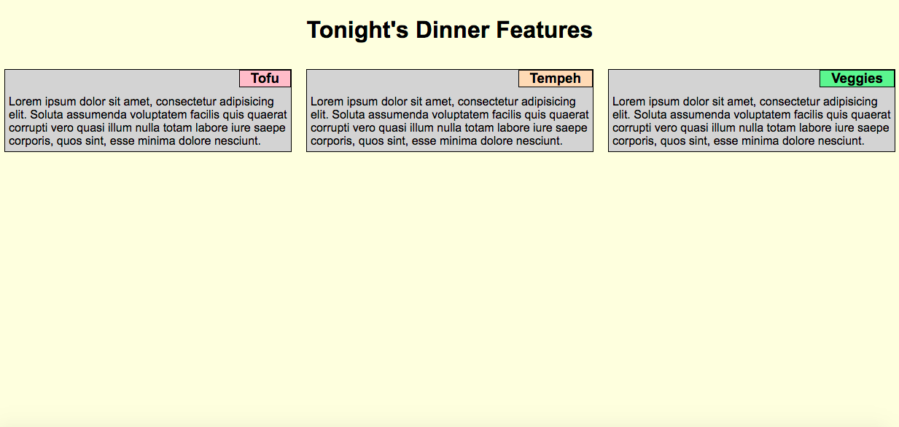

# Dinner Menu

This is a basic layout for what is intended to be a restaurant menu.  The design is responsive using media queries; no CSS frameworks, such as Bootstrap, are used.  The rows and columns align properly and evenly according to screen size.  The three sections occupy one row when in desktop view at 992px and above.  In tablet view, when the screen size is between 768px and 991px, the sections appear in two rows with two sections occupying the top row and one section occupying the entire bottom row.  In mobile view, when the screen size is 767px and below, the three sections appear in one column.  Relative and absolute positioning are used for the three sections on the menu.  This application was created using HTML5 and CSS3.

Deployed: https://caseofbase18.github.io/module2-solution/

### Image of Page

